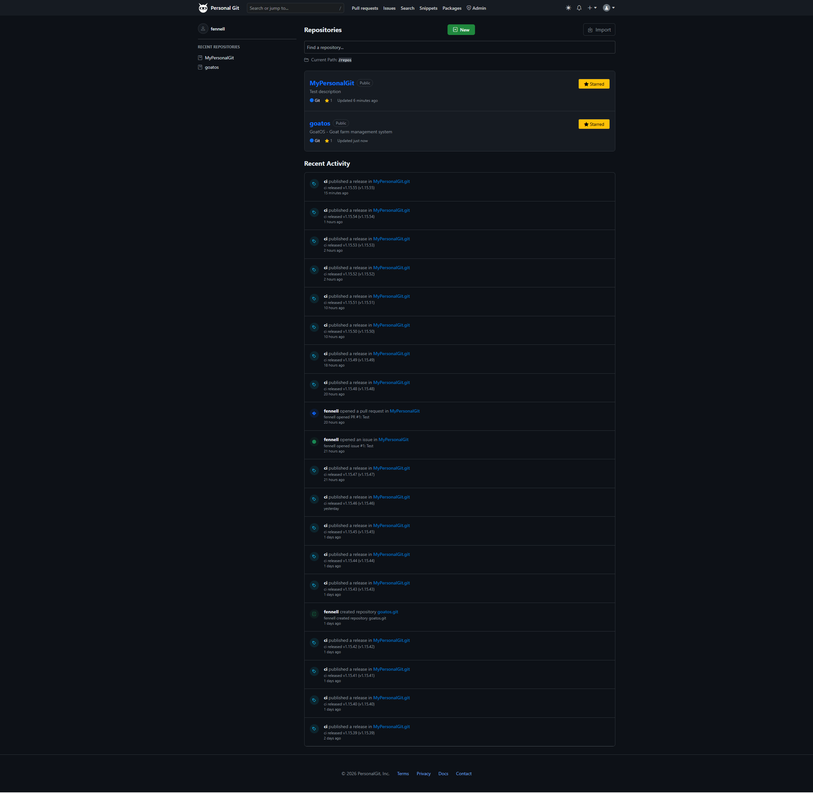

# MyPersonalGit

[](https://dotnet.microsoft.com/)
[](https://dotnet.microsoft.com/apps/aspnet/web-apps/blazor)
[](https://www.sqlite.org/)
[](https://www.postgresql.org/)
[](https://hub.docker.com/r/fennch/mypersonalgit)
[](LICENSE)
[](https://github.com/ChrisDFennell/MyPersonalGit)

A self-hosted Git server with a GitHub-like web interface built with ASP.NET Core and Blazor Server. Browse repositories, manage issues, pull requests, wikis, projects, and more — all from your own machine or server.



---

## Table of Contents

- [Features](#features)
- [Tech Stack](#tech-stack)
- [Quick Start](#quick-start)
  - [Docker (Recommended)](#docker-recommended)
  - [Run Locally](#run-locally)
  - [Environment Variables](#environment-variables)
- [Usage](#usage)
  - [Sign In](#1-sign-in)
  - [Create a Repository](#2-create-a-repository)
  - [Clone and Push](#3-clone-and-push)
  - [Clone from an IDE](#4-clone-from-an-ide)
  - [Web Editor](#5-use-the-web-editor)
  - [Container Registry](#6-container-registry)
  - [Package Registry](#7-package-registry)
  - [Pages (Static Sites)](#8-pages-static-site-hosting)
  - [Push Notifications](#9-push-notifications)
  - [SSH Key Authentication](#10-ssh-key-authentication)
  - [LDAP / Active Directory](#11-ldap--active-directory-authentication)
  - [Repository Secrets](#12-repository-secrets)
  - [OAuth / SSO Login](#13-oauth--sso-login)
  - [Import Repository](#14-import-repository)
  - [Forking & Upstream Sync](#15-forking--upstream-sync)
- [Database Configuration](#database-configuration)
  - [Using PostgreSQL](#using-postgresql)
  - [Switching from the Admin Dashboard](#switching-from-the-admin-dashboard)
  - [Choosing a Database](#choosing-a-database)
- [Deploy to a NAS](#deploy-to-a-nas)
- [Configuration](#configuration)
- [Project Structure](#project-structure)
- [Running Tests](#running-tests)
- [License](#license)

---

## Features

### Code & Repositories
- **Repository Management** — Create, browse, and delete Git repositories with a full code browser, file editor, commit history, branches, and tags
- **Repository Import/Migration** — Import repositories from GitHub, GitLab, Bitbucket, or any Git URL with optional issue and PR import. Background processing with progress tracking
- **Repository Archiving** — Mark repositories as read-only with visual badges; pushes are blocked for archived repos
- **Git Smart HTTP** — Clone, fetch, and push over HTTP with Basic Auth
- **Built-in SSH Server** — Native SSH server for Git operations — no external OpenSSH required. Supports ECDH key exchange, AES-CTR encryption, and public key authentication (RSA, ECDSA, Ed25519)
- **SSH Key Authentication** — Add SSH public keys to your account and authenticate Git operations via SSH with auto-managed `authorized_keys` (or the built-in SSH server)
- **Forks & Upstream Sync** — Fork repositories, sync forks with upstream with one click, and see fork relationships in the UI
- **Git LFS** — Large File Storage support for tracking binary files
- **Repository Mirroring** — Mirror repositories to/from external Git remotes
- **Compare View** — Compare branches with ahead/behind commit counts and full diff rendering
- **Language Stats** — GitHub-style language breakdown bar on each repository page
- **Branch Protection** — Configurable rules for required reviews, status checks, and force-push prevention
- **Explore** — Browse all accessible repositories with search, sort, and topic filtering
- **Search** — Full-text search across repositories, issues, PRs, and code

### Collaboration
- **Issues & Pull Requests** — Create, comment on, close/reopen issues and PRs with labels, assignees, and reviews. Merge PRs with merge commit, squash, or rebase strategies. Web-based merge conflict resolution with side-by-side diff view
- **Merge Conflict Resolution** — Resolve merge conflicts directly in the browser with a visual editor showing base/ours/theirs views, quick accept buttons, and conflict marker validation
- **Discussions** — GitHub Discussions-style threaded conversations per repository with categories (General, Q&A, Announcements, Ideas, Show & Tell, Polls), pin/lock, mark as answer, and upvoting
- **Code Review Suggestions** — "Suggest changes" mode in PR inline reviews lets reviewers propose code replacements directly in the diff
- **Reaction Emoji** — React to issues, PRs, discussions, and comments with thumbs up/down, heart, laugh, hooray, confused, rocket, and eyes
- **Draft Issues & Issue Templates** — Create draft issues (work-in-progress) and define reusable issue templates (bug report, feature request) per repository with default labels
- **Wiki** — Markdown-based wiki pages per repository with revision history
- **Projects** — Kanban boards with drag-and-drop cards for organizing work
- **Snippets** — Share code snippets (like GitHub Gists) with syntax highlighting and multiple files
- **Organizations & Teams** — Create organizations with members and teams, assign team permissions to repositories
- **Granular Permissions** — Five-tier permission model (Read, Triage, Write, Maintain, Admin) for fine-grained access control on repositories
- **Milestones** — Track issue progress toward milestones with progress bars and due dates
- **Commit Comments** — Comment on individual commits with optional file/line references
- **Repository Topics** — Tag repositories with topics for discovery and filtering on the Explore page

### CI/CD & DevOps
- **CI/CD Runner** — Define workflows in `.github/workflows/*.yml` and run them in Docker containers
- **Secrets Management** — Encrypted repository secrets (AES-256) injected as environment variables into CI/CD workflow runs
- **Webhooks** — Trigger external services on repository events
- **Prometheus Metrics** — Built-in `/metrics` endpoint for monitoring

### Package & Container Hosting
- **Container Registry** — Host Docker/OCI images with `docker push` and `docker pull` (OCI Distribution Spec)
- **NuGet Registry** — Host .NET packages with full NuGet v3 API (service index, search, push, restore)
- **npm Registry** — Host Node.js packages with standard npm publish/install
- **Generic Packages** — Upload and download arbitrary binary artifacts via REST API

### Static Sites
- **Pages** — Serve static websites directly from a repository branch (like GitHub Pages) at `/pages/{owner}/{repo}/`

### Notifications
- **In-App Notifications** — Mentions, comments, and repository activity
- **Push Notifications** — Ntfy and Gotify integration for real-time mobile/desktop alerts with per-user opt-in

### Authentication
- **OAuth2 / SSO** — Sign in with GitHub, Google, Microsoft, GitLab, Bitbucket, Facebook, Discord, or Twitter/X. Admins configure Client ID and Secret per provider in the Admin dashboard — only providers with credentials filled in are shown to users
- **LDAP / Active Directory** — Authenticate users against an LDAP directory or Active Directory domain. Users are auto-provisioned on first login with synced attributes (email, display name). Supports group-based admin promotion, SSL/TLS, and StartTLS
- **Two-Factor Authentication** — TOTP-based 2FA with authenticator app support and recovery codes
- **Linked Accounts** — Users can link multiple OAuth providers to their account from Settings

### Administration
- **Admin Dashboard** — System settings (including database provider, SSH server, LDAP/AD), user management, audit logs, and statistics
- **User Profiles** — Contribution heatmap, activity feed, and stats per user
- **Personal Access Tokens** — Token-based API authentication with configurable scopes
- **Backup & Restore** — Export and import server data
- **Security** — Security advisories, dependency scanning, and vulnerability tracking
- **Dark Mode** — Full dark/light mode support with a toggle in the header

## Tech Stack

| Component | Technology |
|-----------|-----------|
| Backend | ASP.NET Core 10.0 |
| Frontend | Blazor Server (interactive server-side rendering) |
| Database | SQLite (default) or PostgreSQL via Entity Framework Core 10 |
| Git Engine | LibGit2Sharp |
| Auth | BCrypt password hashing, session-based auth, PAT tokens, OAuth2 (8 providers), TOTP 2FA, LDAP/AD |
| SSH Server | Built-in SSH2 protocol implementation (ECDH, AES-CTR, HMAC-SHA2) |
| Markdown | Markdig |
| CI/CD | Docker.DotNet, YamlDotNet |
| Monitoring | Prometheus metrics |

## Quick Start

### Prerequisites

- [Docker](https://docs.docker.com/get-docker/) (recommended)
- Or [.NET 10 SDK](https://dotnet.microsoft.com/download/dotnet/10.0) + Git for local development

### Docker (Recommended)

Pull from Docker Hub and run:

```bash
docker run -d --name mypersonalgit -p 8080:8080 -p 2222:2222 \
  -v mypersonalgit-repos:/repos \
  -v mypersonalgit-data:/data \
  -e Git__Users__admin=admin \
  fennch/mypersonalgit:latest
```

> Port 2222 is optional — only needed if you enable the built-in SSH server in Admin > Settings.

Or use Docker Compose:

```bash
git clone https://github.com/ChrisDFennell/MyPersonalGit.git
cd MyPersonalGit
docker compose up -d
```

The app will be available at **http://localhost:8080**.

> **Default credentials**: `admin` / `admin`
>
> **Change the default password immediately** via the Admin dashboard after first login.

### Run Locally

```bash
git clone https://github.com/ChrisDFennell/MyPersonalGit.git
cd MyPersonalGit/MyPersonalGit
dotnet run
```

The app starts at **http://localhost:5146**.

### Environment Variables

| Variable | Description | Default |
|----------|-------------|---------|
| `Database__Provider` | Database engine: `sqlite` or `postgresql` | `sqlite` |
| `ConnectionStrings__Default` | Database connection string | `Data Source=/data/mypersonalgit.db` |
| `Git__ProjectRoot` | Directory where Git repos are stored | `/repos` |
| `Git__RequireAuth` | Require auth for Git HTTP operations | `true` |
| `Git__Users__<username>` | Set password for Git HTTP Basic Auth user | — |
| `RESET_ADMIN_PASSWORD` | Emergency admin password reset on startup | — |
| `Secrets__EncryptionKey` | Custom encryption key for repository secrets | Derived from DB connection string |
| `Ssh__DataDir` | Directory for SSH data (host keys, authorized_keys) | `~/.mypersonalgit/ssh` |
| `Ssh__AuthorizedKeysPath` | Path to generated authorized_keys file | `<DataDir>/authorized_keys` |

> **Note:** The built-in SSH server port and LDAP settings are configured through the Admin dashboard (Admin > Settings), not environment variables. This lets you change them without redeploying.

## Usage

### 1. Sign In

Open the app and click **Sign In**. On a fresh install, use the default credentials (`admin` / `admin`). Create additional users via the **Admin** dashboard or by enabling user registration in Admin > Settings.

### 2. Create a Repository

Click the green **New** button on the home page, enter a name, and click **Create**. This creates a bare Git repository on the server that you can clone, push to, and manage through the web UI.

### 3. Clone and Push

```bash
git clone http://localhost:8080/git/MyRepo.git
cd MyRepo

echo "# My Project" > README.md
git add .
git commit -m "Initial commit"
git push origin main
```

If Git HTTP auth is enabled, you'll be prompted for the credentials configured via `Git__Users__<username>` environment variables. These are separate from the web UI login.

### 4. Clone from an IDE

**VS Code**: `Ctrl+Shift+P` > **Git: Clone** > paste `http://localhost:8080/git/MyRepo.git`

**Visual Studio**: **Git > Clone Repository** > paste the URL

**JetBrains**: **File > New > Project from Version Control** > paste the URL

### 5. Use the Web Editor

You can edit files directly in the browser:
- Navigate to a repository and click on any file, then click **Edit**
- Use **Add files > Create new file** to add files without a local clone
- Use **Add files > Upload files/folder** to upload from your machine

### 6. Container Registry

Push and pull Docker/OCI images directly to your server:

```bash
# Log in (use a Personal Access Token from Settings > Access Tokens)
docker login localhost:8080 -u youruser

# Push an image
docker tag myapp:latest localhost:8080/myapp:v1
docker push localhost:8080/myapp:v1

# Pull an image
docker pull localhost:8080/myapp:v1
```

> **Note:** Docker requires HTTPS by default. For HTTP, add your server to Docker's `insecure-registries` in `~/.docker/daemon.json`:
> ```json
> { "insecure-registries": ["localhost:8080"] }
> ```

### 7. Package Registry

**NuGet (.NET packages):**
```bash
dotnet nuget add source http://localhost:8080/api/packages/nuget/v3/index.json \
  --name mygit --username youruser --password yourPAT
dotnet nuget push MyPackage.1.0.0.nupkg --source mygit --api-key yourPAT
```

**npm (Node.js packages):**
```bash
npm config set //localhost:8080/api/packages/npm/:_authToken="yourPAT"
npm publish --registry=http://localhost:8080/api/packages/npm
```

**Generic (any binary):**
```bash
curl -u youruser:yourPAT -X PUT \
  --upload-file myfile.zip \
  http://localhost:8080/api/packages/generic/my-tool/1.0.0/myfile.zip
```

Browse all packages at `/packages` in the web UI.

### 8. Pages (Static Site Hosting)

Serve static websites from a repository branch:

1. Go to your repository's **Settings** tab and enable **Pages**
2. Set the branch (default: `gh-pages`)
3. Push HTML/CSS/JS to that branch
4. Visit `http://localhost:8080/pages/{username}/{repo}/`

### 9. Push Notifications

Configure Ntfy or Gotify in **Admin > System Settings** to receive push notifications on your phone or desktop when issues, PRs, or comments are created. Users can opt in/out in **Settings > Notifications**.

### 10. SSH Key Authentication

Use SSH keys for passwordless Git operations. There are two options:

#### Option A: Built-in SSH Server (Recommended)

No external SSH daemon required — MyPersonalGit runs its own SSH server:

1. Go to **Admin > Settings** and enable **Built-in SSH Server**
2. Set the SSH port (default: 2222) — use 22 if you're not running system SSH
3. Save settings and restart the server (port changes require restart)
4. Go to **Settings > SSH Keys** and add your public key (`~/.ssh/id_ed25519.pub`, `~/.ssh/id_rsa.pub`, or `~/.ssh/id_ecdsa.pub`)
5. Clone via SSH:
   ```bash
   git clone ssh://youruser@yourserver:2222/MyRepo.git
   ```

The built-in SSH server supports ECDH-SHA2-NISTP256 key exchange, AES-128/256-CTR encryption, HMAC-SHA2-256, and public key authentication with Ed25519, RSA, and ECDSA keys.

#### Option B: System OpenSSH

If you prefer to use your system's SSH daemon:

1. Go to **Settings > SSH Keys** and add your public key
2. MyPersonalGit automatically maintains an `authorized_keys` file from all registered SSH keys
3. Configure your server's OpenSSH to use the generated authorized_keys file:
   ```
   # In /etc/ssh/sshd_config
   AuthorizedKeysFile /path/to/.mypersonalgit/ssh/authorized_keys
   ```
4. Clone via SSH:
   ```bash
   git clone ssh://git@yourserver:22/repos/MyRepo.git
   ```

The SSH auth service also exposes an API at `/api/ssh/authorized-keys` for use with OpenSSH's `AuthorizedKeysCommand` directive.

### 11. LDAP / Active Directory Authentication

Authenticate users against your organization's LDAP directory or Active Directory domain:

1. Go to **Admin > Settings** and scroll to **LDAP / Active Directory Authentication**
2. Enable LDAP and fill in your server details:
   - **Server**: Your LDAP server hostname (e.g., `dc01.corp.local`)
   - **Port**: 389 for LDAP, 636 for LDAPS
   - **SSL/TLS**: Enable for LDAPS, or use StartTLS for upgrading a plain connection
3. Configure a service account for searching users:
   - **Bind DN**: `CN=svc-git,OU=Service Accounts,DC=corp,DC=local`
   - **Bind Password**: The service account password
4. Set the search parameters:
   - **Search Base DN**: `OU=Users,DC=corp,DC=local`
   - **User Filter**: `(sAMAccountName={0})` for AD, `(uid={0})` for OpenLDAP
5. Map LDAP attributes to user fields:
   - **Username**: `sAMAccountName` (AD) or `uid` (OpenLDAP)
   - **Email**: `mail`
   - **Display Name**: `displayName`
6. Optionally set an **Admin Group DN** — members of this group are automatically promoted to admin
7. Click **Test LDAP Connection** to verify the settings
8. Save settings

Users can now sign in with their domain credentials on the login page. On first login, a local account is auto-created with attributes synced from the directory. LDAP authentication is also used for Git HTTP operations (clone/push).

### 12. Repository Secrets

Add encrypted secrets to repositories for use in CI/CD workflows:

1. Go to your repository's **Settings** tab
2. Scroll to the **Secrets** card and click **Add secret**
3. Enter a name (e.g., `DEPLOY_TOKEN`) and value — the value is encrypted with AES-256
4. Secrets are automatically injected as environment variables into every workflow run

Reference secrets in your workflow:
```yaml
jobs:
  deploy:
    runs-on: ubuntu-latest
    steps:
      - name: Deploy
        run: curl -H "Authorization: Bearer $DEPLOY_TOKEN" https://api.example.com/deploy
```

### 13. OAuth / SSO Login

Sign in with external identity providers:

1. Go to **Admin > OAuth / SSO** and configure the providers you want to enable
2. Enter the **Client ID** and **Client Secret** from the provider's developer console
3. Check **Enable** — only providers with both credentials filled in will appear on the login page
4. The callback URL for each provider is shown in the admin panel (e.g., `https://yourserver/oauth/callback/github`)

Supported providers: GitHub, Google, Microsoft, GitLab, Bitbucket, Facebook, Discord, Twitter/X.

Users can link multiple providers to their account in **Settings > Linked Accounts**.

### 14. Import Repository

Import repositories from external sources with full history:

1. Click **Import** on the home page
2. Select a source type (Git URL, GitHub, GitLab, or Bitbucket)
3. Enter the repository URL and optionally an auth token for private repos
4. For GitHub/GitLab/Bitbucket imports, optionally import issues and pull requests
5. Track import progress in real-time on the Import page

### 15. Forking & Upstream Sync

Fork a repository and keep it in sync:

1. Click the **Fork** button on any repository page
2. A fork is created under your username with a link back to the original
3. Click **Sync fork** next to the "forked from" badge to pull latest changes from upstream

## Database Configuration

MyPersonalGit uses **SQLite** by default — zero configuration, single-file database, perfect for personal use and small teams.

For larger deployments (many concurrent users, high availability, or if you already run PostgreSQL), you can switch to **PostgreSQL**:

### Using PostgreSQL

**Docker Compose** (recommended for PostgreSQL):
```yaml
services:
  mypersonalgit:
    image: fennch/mypersonalgit:latest
    ports:
      - "8080:8080"
      - "2222:2222"
    environment:
      - Database__Provider=postgresql
      - ConnectionStrings__Default=Host=db;Database=mypersonalgit;Username=mypg;Password=secret
    depends_on:
      - db
    volumes:
      - repos:/repos

  db:
    image: postgres:17
    environment:
      - POSTGRES_DB=mypersonalgit
      - POSTGRES_USER=mypg
      - POSTGRES_PASSWORD=secret
    volumes:
      - pgdata:/var/lib/postgresql/data

volumes:
  repos:
  pgdata:
```

**Environment variables only** (if you already have a PostgreSQL server):
```bash
docker run -d --name mypersonalgit -p 8080:8080 \
  -v mypersonalgit-repos:/repos \
  -e Database__Provider=postgresql \
  -e ConnectionStrings__Default="Host=your-pg-server;Database=mypersonalgit;Username=mypg;Password=secret" \
  fennch/mypersonalgit:latest
```

EF Core migrations run automatically on startup for both providers. No manual schema setup required.

### Switching from the Admin Dashboard

You can also switch database providers directly from the web UI:

1. Go to **Admin > Settings** — the **Database** card is at the top
2. Select **PostgreSQL** from the provider dropdown
3. Enter your PostgreSQL connection string (e.g., `Host=localhost;Database=mypersonalgit;Username=mypg;Password=secret`)
4. Click **Save Database Settings**
5. Restart the application for the change to take effect

The config is saved to `~/.mypersonalgit/database.json` (outside the database itself, so it can be read before connecting).

### Choosing a Database

| | SQLite | PostgreSQL |
|---|---|---|
| **Setup** | Zero config (default) | Requires a PostgreSQL server |
| **Best for** | Personal use, small teams, NAS | Teams of 50+, high concurrency |
| **Backup** | Copy the `.db` file | Standard `pg_dump` |
| **Concurrency** | Single-writer (fine for most use) | Full multi-writer |
| **Migration** | N/A | Switch provider + run the app (auto-migrates) |

## Deploy to a NAS

MyPersonalGit works great on a NAS (QNAP, Synology, etc.) via Docker:

```bash
docker run -d --name mypersonalgit -p 8080:8080 -p 2222:2222 \
  -v /share/Container/mypersonalgit/repos:/repos \
  -v /share/Container/mypersonalgit/data:/data \
  -v /var/run/docker.sock:/var/run/docker.sock \
  -e ConnectionStrings__Default="Data Source=/data/mypersonalgit.db" \
  -e Git__Users__admin=yourpassword \
  fennch/mypersonalgit:latest
```

The Docker socket mount is optional — only needed if you want CI/CD workflow execution. Port 2222 is only needed if you enable the built-in SSH server.

## Configuration

All settings can be configured in `appsettings.json`, via environment variables, or through the Admin dashboard at `/admin`:

- Database provider (SQLite or PostgreSQL)
- Project root directory
- Authentication requirements
- User registration settings
- Feature toggles (Issues, Wiki, Projects, Actions)
- Max repository size and count per user
- SMTP settings for email notifications
- Push notification settings (Ntfy/Gotify)
- Built-in SSH server (enable/disable, port)
- LDAP/Active Directory authentication (server, bind DN, search base, user filter, attribute mapping, admin group)
- OAuth/SSO provider configuration (Client ID/Secret per provider)

## Project Structure

```
MyPersonalGit/
  Components/
    Layout/          # MainLayout, NavMenu
    Pages/           # Blazor pages (Home, RepoDetails, Issues, PRs, Packages, etc.)
  Controllers/       # REST API endpoints (NuGet, npm, Generic, Registry, etc.)
  Data/              # EF Core DbContext, service implementations
  Models/            # Domain models
  Migrations/        # EF Core migrations
  Services/          # Middleware (auth, Git HTTP backend, Pages, Registry auth)
    SshServer/       # Built-in SSH server (SSH2 protocol, ECDH, AES-CTR)
  Program.cs         # App startup, DI, middleware pipeline
MyPersonalGit.Tests/
  UnitTest1.cs       # xUnit tests with InMemory database
```

## Running Tests

```bash
dotnet test
```

## License

MIT
